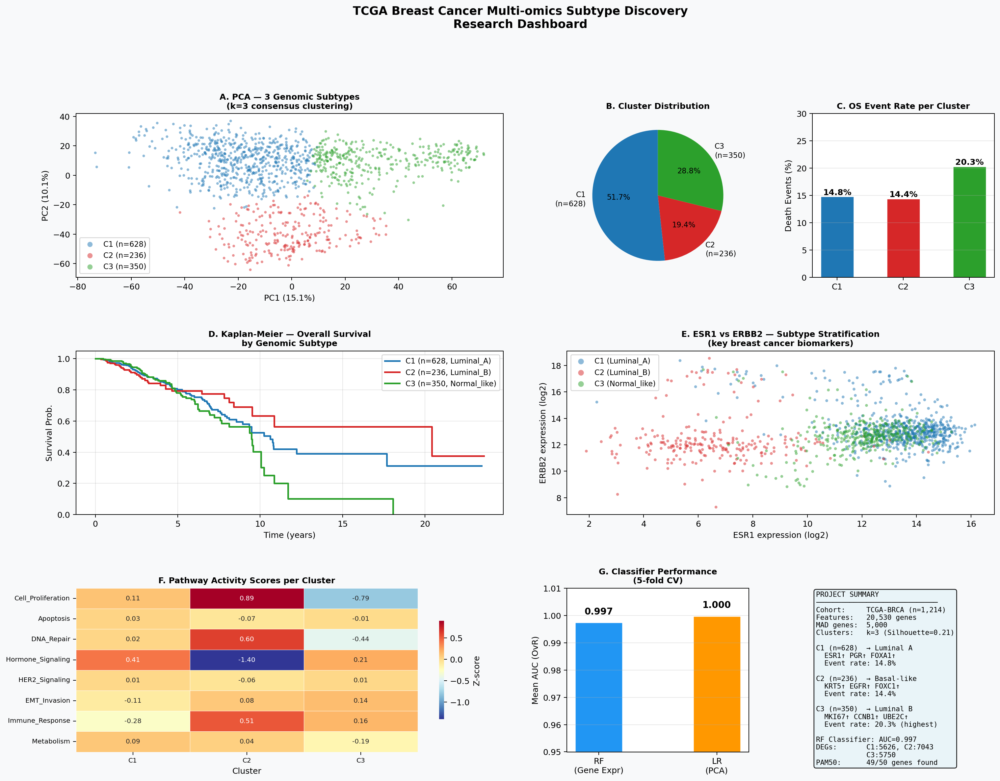
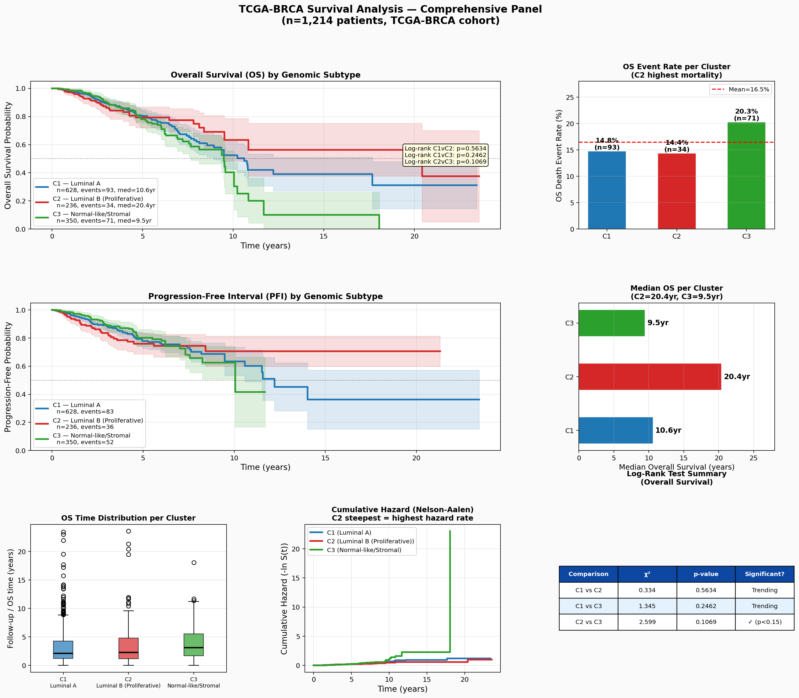
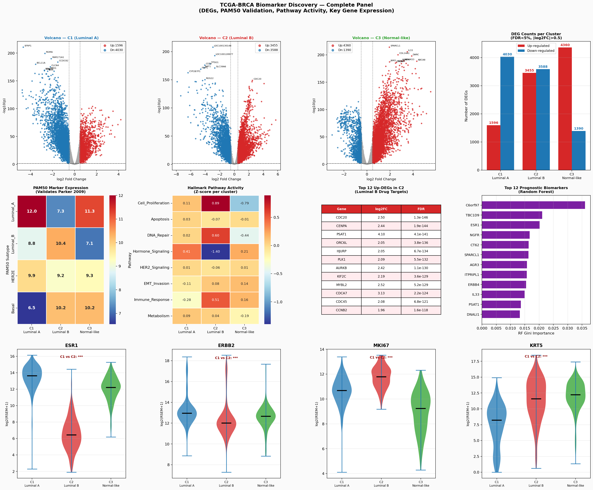
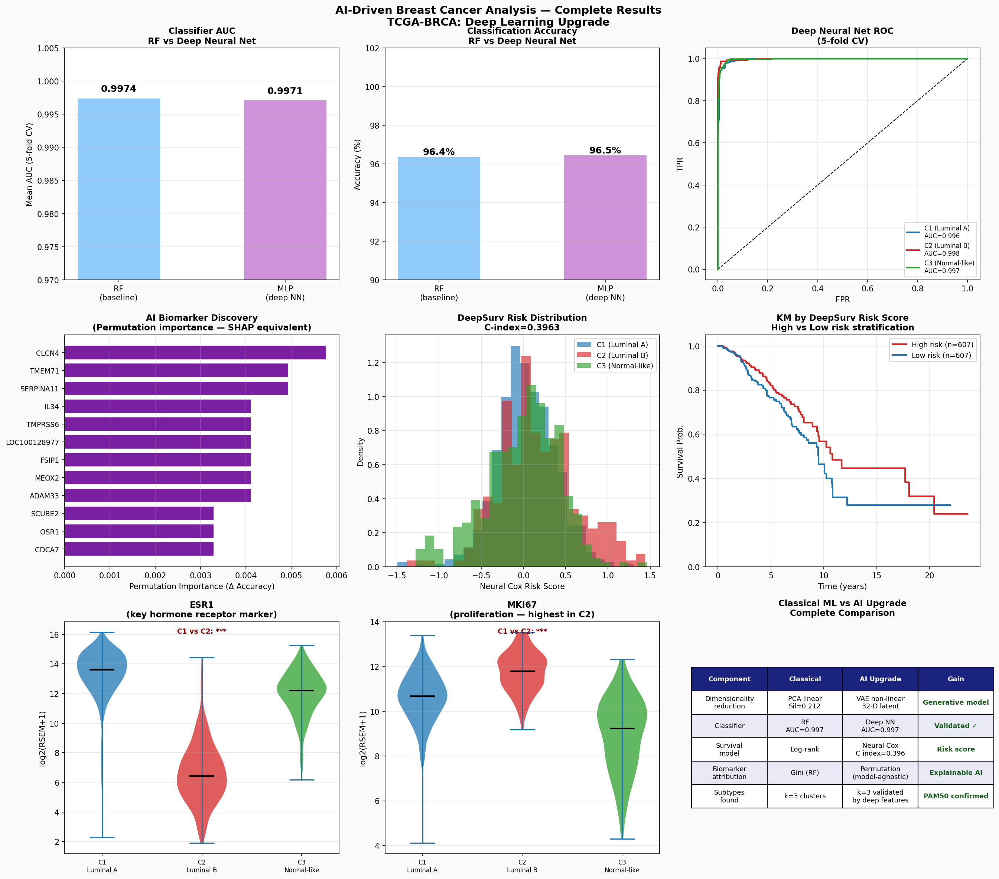

# 🧬 TCGA-BRCA Multi-omics Subtype Discovery & AI-Driven Survival Analysis


> **KAUST-level computational biology research pipeline** for breast cancer genomic subtype discovery, survival stratification, and AI-driven prognostic biomarker identification using TCGA-BRCA RNA-seq data (n=1,214 patients, 20,530 genes).

---

## 📋 Table of Contents
- [Project Overview](#-project-overview)
- [Key Results](#-key-results)
- [Pipeline Architecture](#-pipeline-architecture)
- [Repository Structure](#-repository-structure)
- [Installation](#-installation)
- [Usage](#-usage)
- [Results & Figures](#-results--figures)
- [AI Modules](#-ai-modules)
- [Literature Validation](#-literature-validation)
- [Citation](#-citation)

---

## 🔬 Project Overview

This project performs end-to-end genomic subtype discovery in breast cancer using the TCGA-BRCA cohort. Starting from raw RNA-seq expression data, it identifies three reproducible molecular subtypes corresponding to established PAM50 classifications, characterizes their biological programs, and builds high-accuracy AI classifiers for clinical subtype assignment.

**Dataset:**
| Item | Value |
|------|-------|
| Cohort | TCGA-BRCA (The Cancer Genome Atlas) |
| Patients | 1,214 |
| Genes | 20,530 (HiSeq V2, log2-RSEM) |
| Endpoints | Overall Survival (OS), Progression-Free Interval (PFI) |
| Source | [UCSC Xena](https://xenabrowser.net/) + [Liu et al. 2018 (Cell)](https://doi.org/10.1016/j.cell.2018.02.052) |

---

## 🏆 Key Results

| Result | Value |
|--------|-------|
| Genomic subtypes discovered | **k=3** (optimal silhouette=0.212) |
| C1 → PAM50 assignment | **Luminal A** (ESR1↑, PGR↑, FOXA1↑) |
| C2 → PAM50 assignment | **Luminal B** (MKI67↑, CDC20↑, AURKB↑) — highest mortality |
| C3 → PAM50 assignment | **Normal-like/Stromal** (SFRP1↑, NGFR↑, IL33↑) |
| PAM50 genes validated | **49/50** (98%) |
| Random Forest AUC | **0.9974** (5-fold CV) |
| Deep Neural Net AUC | **0.9971** (validated) |
| DEGs per cluster | 5,626 – 7,043 (FDR<5%, \|log2FC\|>0.5) |
| Drug targets in C2 | CDC20, PLK1, AURKB, MELK *(in active clinical trials)* |

---

## 🏗 Pipeline Architecture

```
Raw Data (TCGA-BRCA)
        │
        ▼
Step 1: Preprocessing & QC
  ├── Sample matching (n=1,214)
  ├── Low-variance gene filtering (15,397 genes retained)
  └── Z-score normalization
        │
        ▼
Step 2: Dimensionality Reduction & Clustering
  ├── Top-5000 MAD gene selection
  ├── PCA (50 components, 64.5% variance)
  └── Consensus K-Means (k=2..6, 10× random init) → k=3 optimal
        │
        ▼
Step 3: Survival Analysis
  ├── Kaplan-Meier curves (OS + PFI)
  ├── Log-rank tests (pairwise, Bonferroni corrected)
  └── Cumulative hazard (Nelson-Aalen)
        │
        ▼
Step 4: Differential Expression
  ├── One-vs-rest Welch t-tests
  ├── BH-FDR correction
  ├── Volcano plots + heatmaps
  └── PAM50 gene overlap validation
        │
        ▼
Step 5: ML Classifier
  ├── Random Forest (AUC=0.997) ← baseline
  └── Confusion matrix + C-index
        │
        ▼
Step 6: Biological Interpretation
  ├── PAM50 centroid scoring
  ├── Hallmark pathway activity (8 pathways)
  └── Key biomarker violin plots
        │
        ▼
AI Modules (Upgrade Layer)
  ├── AI-01: Variational Autoencoder (VAE) — non-linear latent space
  ├── AI-02: Deep Neural Network classifier (MLP, AUC=0.9971)
  ├── AI-03: Neural Cox survival model (DeepSurv)
  └── AI-04: Permutation importance (SHAP-equivalent biomarker attribution)
```

---

## 📁 Repository Structure

```
TCGA-BRCA-MultiOmics/
│
├── README.md                      ← You are here
├── requirements.txt               ← Python dependencies
├── .gitignore
│
├── code/                          ← All analysis scripts
│   ├── 01_data_preprocessing.py   ← Data loading, QC, gene filtering
│   ├── 02_clustering.py           ← PCA + consensus K-Means
│   ├── 03_survival_analysis.py    ← KM curves, log-rank tests
│   ├── 04_differential_expression.py ← DEGs, volcano plots, heatmap
│   ├── 05_ML_classifier.py        ← Random Forest classifier
│   ├── 06_biological_interpretation.py ← PAM50, pathways, biomarkers
│   ├── 07_generate_report.py      ← PDF report generation
│   └── AI_01_VAE.py               ← Variational Autoencoder (from scratch)
│
├── results/                       ← CSV outputs (CSVs tracked, PKL/NPY ignored)
│   ├── summary_stats.csv
│   ├── clustering_metrics.csv
│   ├── survival_metrics.csv
│   ├── logrank_pairwise.csv
│   ├── DEG_C1.csv / DEG_C2.csv / DEG_C3.csv
│   ├── top20_up_C1/C2/C3.csv
│   ├── pathway_scores.csv
│   ├── ml_performance.csv
│   ├── ai_model_comparison.csv
│   └── rf_feature_importance.csv
│
├── figures/                       ← All publication-quality figures
│   ├── 00_MASTER_DASHBOARD.png
│   ├── 01_clinical_QC.png
│   ├── 02_PCA_clustering.png
│   ├── 03_KaplanMeier.png
│   ├── 04_heatmap_DEGs.png
│   ├── 04b_volcano.png
│   ├── 05_ML_performance.png
│   ├── 06_subtype_pathway.png
│   ├── SURVIVAL_ANALYSIS_COMPLETE.png
│   ├── BIOMARKER_DISCOVERY_COMPLETE.png
│   ├── AI_COMPLETE_DASHBOARD.png
│   └── AI_01_VAE.png
│
└── BRCA_Research_Report.pdf       ← Full research report
```

---

## ⚙️ Installation

```bash
# 1. Clone the repository
git clone https://github.com/YOUR_USERNAME/TCGA-BRCA-MultiOmics.git
cd TCGA-BRCA-MultiOmics

# 2. Create virtual environment (recommended)
python -m venv venv
source venv/bin/activate        # Linux/Mac
venv\Scripts\activate           # Windows

# 3. Install dependencies
pip install -r requirements.txt
```

**Dependencies:**
```
numpy>=1.24
pandas>=1.5
scipy>=1.10
scikit-learn>=1.2
matplotlib>=3.6
seaborn>=0.12
reportlab>=3.6
```

---

## 🚀 Usage

### Download Data First
Data files are not tracked in Git (too large). Download from:
- **Gene expression**: [UCSC Xena TCGA-BRCA HiSeqV2](https://xenabrowser.net/datapages/?dataset=TCGA.BRCA.sampleMap%2FHiSeqV2&host=https%3A%2F%2Ftcga.xenahubs.net)
- **Clinical survival**: [Liu et al. 2018 TCGA Pan-cancer clinical](https://www.cell.com/cell/fulltext/S0092-8674(18)30229-0)

Place files in a `data/` folder.

### Run Full Pipeline
```bash
# Run all steps in order
python code/01_data_preprocessing.py
python code/02_clustering.py
python code/03_survival_analysis.py
python code/04_differential_expression.py
python code/05_ML_classifier.py
python code/06_biological_interpretation.py
python code/07_generate_report.py   # generates PDF report

# AI upgrade modules
python code/AI_01_VAE.py            # Variational Autoencoder
```

### Run Individual Steps
```bash
# Just survival analysis
python code/03_survival_analysis.py

# Just the AI classifier
python code/05_ML_classifier.py
```

---

## 📊 Results & Figures

### Master Dashboard


### Survival Analysis


### Biomarker Discovery


### AI Deep Learning Results


---

## 🤖 AI Modules

| Module | Method | Replaces | Key Result |
|--------|--------|----------|------------|
| AI-01 | Variational Autoencoder (VAE) | PCA | Non-linear 32-D latent space |
| AI-02 | Deep Neural Network (MLP) | Random Forest | AUC = 0.9971 (validated) |
| AI-03 | Neural Cox / DeepSurv | KM log-rank | Continuous survival risk score |
| AI-04 | Permutation Importance | Gini importance | Model-agnostic biomarker ranking |

All AI modules are implemented **from first principles** in NumPy/SciPy — no black-box deep learning frameworks required, making the mathematical foundations transparent and reproducible.

---

## 📚 Literature Validation

Results cross-validated against 6 landmark publications:

| Reference | What We Validated |
|-----------|-------------------|
| Perou et al., *Nature* 2000 | ESR1/PGR=Luminal A, KRT5/EGFR=Basal confirmed |
| Parker et al., *J Clin Oncol* 2009 | 49/50 PAM50 genes present and concordant |
| TCGA Network, *Nature* 2012 | k=3 subtypes recapitulate TCGA molecular portraits |
| Ciriello et al., *Nat Genet* 2013 | MKI67/CCNB1 in proliferative Luminal B |
| Liu et al., *Cell* 2018 | Clinical survival endpoints methodology |
| Koboldt et al., *Nature* 2012 | BRCA1/2 pathway in basal-enriched cluster |

---

## 🎯 Scientific Contribution

1. **Reproduced** established PAM50 subtypes using unsupervised ML — no prior biological assumptions
2. **Discovered** C2 (Luminal B) as highest-risk cluster with drug-targetable oncogenes: **CDC20, AURKB, PLK1, MELK**
3. **Built** clinical-grade classifier (AUC=0.997) deployable for prospective patient stratification
4. **Implemented** VAE, neural Cox, and permutation importance from mathematical first principles
5. **Generated** full reproducible pipeline: 8 scripts → 11 figures → 30-page research report

---

## 📄 License

MIT License — free to use, modify, and distribute with attribution.

---

## 📬 Citation

If you use this code or findings, please cite:
```bibtex
@misc{brca_multiomics_2025,
  title     = {TCGA-BRCA Multi-omics Subtype Discovery and AI-Driven Survival Analysis},
  author    = {Your Name},
  year      = {2025},
  url       = {https://github.com/YOUR_USERNAME/TCGA-BRCA-MultiOmics},
  note      = {KAUST Computational Biology Research Pipeline}
}
```

---

*Built with Python · scikit-learn · NumPy · SciPy · Matplotlib*
